# Architecture & Flow Diagrams

This document contains visual diagrams of the Stripe MRR Analytics pipeline.

## 1. High-Level Architecture

```mermaid
flowchart LR
    subgraph Source["Data Source"]
        S[("🟣 Stripe API")]
    end
    
    subgraph ETL["ETL Pipeline"]
        P["🐍 Python Scripts"]
    end
    
    subgraph Warehouse["Data Warehouse"]
        B[("📊 BigQuery")]
    end
    
    subgraph Backend["API Layer"]
        F["🌐 Flask API"]
    end
    
    subgraph Frontend["Presentation"]
        R["⚛️ React Dashboard"]
    end
    
    S -->|"Extract"| P
    P -->|"Load"| B
    B -->|"SQL Queries"| F
    F -->|"JSON API"| R
```

## 2. Data Pipeline Flow

## 3. API Request Flow

## 4. MRR Calculation Logic

```mermaid
flowchart TD
    subgraph Input["Raw Subscription Data"]
        A["Subscription Records"]
        B["Start Date"]
        C["Cancel Date"]
        D["Price Amount"]
        E["Billing Interval"]
    end
    
    subgraph Calculate["MRR Calculation"]
        F{"Interval Type?"}
        G["Monthly: amount"]
        H["Yearly: amount / 12"]
        I["Weekly: amount × 4.33"]
        J["MRR per Subscription"]
    end
    
    subgraph Aggregate["Monthly Aggregation"]
        K["Group by Month"]
        L["Sum Active MRR"]
        M["Count New Customers"]
        N["Count Churned"]
        O["Calculate Growth Rate"]
    end
    
    subgraph Output["mrr_monthly_summary"]
        P["total_mrr"]
        Q["new_mrr"]
        R["churned_mrr"]
        S["active_customers"]
        T["churn_rate"]
    end
    
    A --> F
    D --> F
    E --> F
    F -->|monthly| G
    F -->|yearly| H
    F -->|weekly| I
    G --> J
    H --> J
    I --> J
    
    J --> K
    B --> K
    C --> K
    
    K --> L
    K --> M
    K --> N
    L --> O
    
    L --> P
    M --> Q
    N --> R
    K --> S
    N --> T
```

## 5. Component Architecture

## 6. Data Model (ERD)

## 7. Deployment Architecture (Future)

```mermaid
flowchart TB
    subgraph Production["Production Setup"]
        subgraph Scheduler["Automation"]
            CRON["Cloud Scheduler"]
            CF["Cloud Functions"]
        end
        
        subgraph Data["Data Layer"]
            STRIPE["Stripe API"]
            BQ["BigQuery"]
        end
        
        subgraph App["Application"]
            CR["Cloud Run"]
            API["Flask API"]
            REACT["React App"]
        end
        
        subgraph CDN["Delivery"]
            GCS["Cloud Storage"]
            LB["Load Balancer"]
        end
    end
    
    CRON -->|trigger| CF
    CF -->|extract| STRIPE
    CF -->|load| BQ
    BQ -->|query| API
    API -->|serve| CR
    REACT -->|hosted| GCS
    GCS --> LB
    CR --> LB
    LB -->|users| Internet["🌐 Internet"]
```

---

## Viewing These Diagrams

These diagrams use [Mermaid](https://mermaid.js.org/) syntax which renders automatically on:
- ✅ GitHub README/Markdown files
- ✅ VS Code with Mermaid extension
- ✅ Notion, Confluence, and other tools

To view locally, install the VS Code extension: `bierner.markdown-mermaid`
